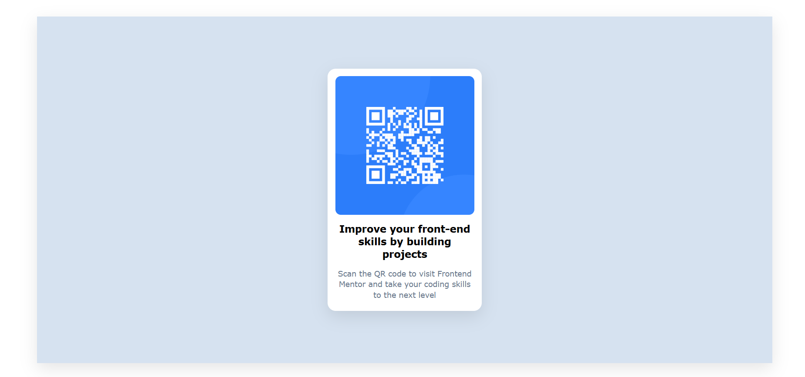

# 🔍 QR Code Component

## 🎯 Sobre o Projeto

Um componente de QR code responsivo desenvolvido com HTML e CSS, seguindo as melhores práticas de design moderno.

## 🖼️ Preview do Projeto



## ✨ Funcionalidades

✅ Design 100% responsivo  
✅ Layout centralizado vertical e horizontalmente  
✅ Imagem otimizada e proporcional  
✅ Efeitos de sombra e bordas arredondadas  
✅ Código semântico e acessível

## 🛠️ Tecnologias Utilizadas

- **HTML5** - Estrutura semântica
- **CSS3** - Estilização moderna
- **Flexbox** - Layout flexível
- **Media Queries** - Responsividade
- **Viewport Units** - Dimensões adaptativas

## 🎨 Características do Design

**Cores:**

- Fundo branco: `hsl(0, 0%, 100%)`
- Fundo principal: `hsl(212, 45%, 89%)`
- Texto escuro: `hsl(0, 0%, 7%)`
- Texto cinza: `hsl(216, 15%, 48%)`

**Tipografia:** Verdana, Geneva, Tahoma, sans-serif  
**Layout:** Card centralizado com sombras sutis

## 📱 Responsividade

Breakpoints estratégicos para:

- **Desktop:** 1024px+
- **Tablet:** 768px
- **Mobile Large:** 425px
- **Mobile Small:** 320px

## 🚀 Como Executar

```bash
# Clone o repositório
git clone https://github.com/seu-usuario/qr-code-component.git

# Abra o arquivo index.html no navegador
# ou use uma extensão Live Server no VS Code
```
